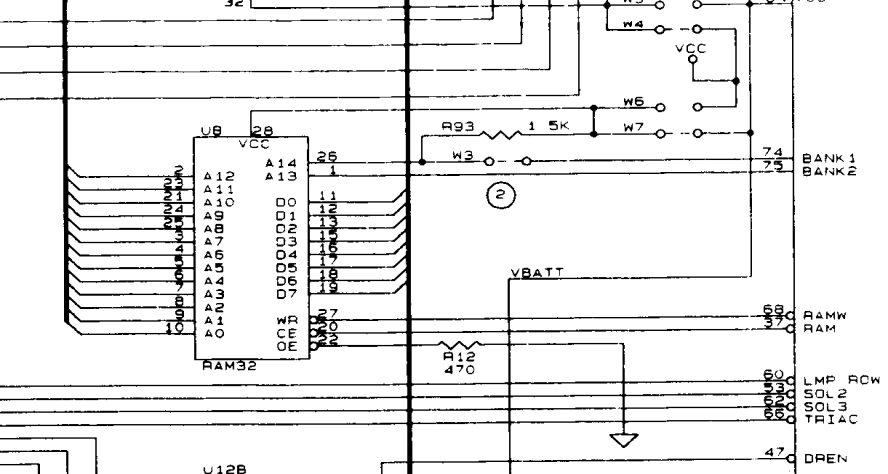

# pinball high scores

[inspiration](http://spritesmods.com/?art=twitter1943)

## plan

* the ds2064 is socketed, so make a [breakout board](ram-fpga) that passes through the connections. 
* add an FPGA that can listen to the 13 address lines, the 8 data lines and the 3 read/write/select pins = 24pins.
* when in write mode, with address in the high score range the FPGA reads the data off the bus.
* write [ds2064 driver](hdl/sram_driver/README.md)

## board test

* data pins tx - ok
* data pins rx - ok - very high impedance!
* addr pins tx - ok
* addr pins rx - ok
* ctrl pins rx - ok
* ctrl pins tx - ok
* on programming fpga, 5v line draws up to 40mA
* added 10k resistor from tranceiver !oe to FPGA 3.3v to keep them off while being programmed

## functional test

* read and write work separately with python control
* however, a write followed by a read works with ram non connected!

# Resources

http://www.pinballsupernova.com/Williams%20Repair%20Guide/Williams%201990-1999%20WPC.pdf
page 20 ram details

emulator https://github.com/neophob/wpc-emu
http://bcd.github.io/freewpc/The-WPC-Hardware.html#The-WPC-Hardware

The CPU board contains the main processor: a Motorola 68B09E, running at 2Mhz. It is an 8-bit/16-bit CPU with a 64KB address space. Bank switching is required to address more than 64KB. On reset, location 0xFFFE is read to determine the address of the first instruction.

8KB of RAM is located at physical address 0x0000. When power is turned off, three AA batteries on the CPU board maintain the state of the RAM. 

## WPC89

fairly sure this is the main board on my doctor who pinball.
[good overview here](http://level42.ca/files/PinRepair/System%20WPC/WPC%20part1/index1.htm)

It uses a battery backed up [ds2064](docs/ds2064.pdf) to store audits and score I hope.

[Schematic](docs/wpc89.pdf)

# Available machines to try

## bride

https://www.ipdb.org/machine.cgi?gid=1502
williams wpc

## high speed

https://www.ipdb.org/machine.cgi?id=1176
Williams System 11

## grand lizard

https://www.ipdb.org/machine.cgi?id=1070
williams system 11

## fire power 

https://www.ipdb.org/machine.cgi?id=856
williams system 6  (rottendog MPU327-4)
good photo: https://pinside.com/pinball/market/classifieds/archive/25465

rottendog sram chip:
https://www.mouser.es/datasheet/2/12/AS6C6264A-1288481.pdf

initial high score is 550,000 = 0x00_g08_64_70 

couldn't find it, so got a fake new score: 803950 = 0x0c_44_6e
         = 80 39 50

         = 50 39 50

motorola 6800 is big endian, intel is little endian

After searching for packed BCD of default string - got a match at 0x1149

    grep -A3 '^1149' dump.8192.5
    1149 55
    114a 00
    114b 00
    114c 00

Then checked for the new high score that we set 803950:

    grep -A3 '^1149' dump.8000.newhigh
    1149 80
    114a 03
    114b 39
    114c 05

Write this to a default chip:

    ./control.py --port /dev/ttyUSB1 --addr-start 1149 --addr-end 114d --read --hex
    1149 80
    114a 03
    114b 39
    114c 05

And then read it back:

    ./control.py --port /dev/ttyUSB1 --addr-start 1149 --addr-end  114d --read --hex
    1149 80
    114a 03
    114b 39
    114c 05

But display shows 503950! Checked one byte before start address 1148:

55 00 00:
1148 05
1149 55
114a 00
114b 00
114c 00

80 39 50:
1148 08
1149 80
114a 03
114b 39
114c 05

And can see it's the low nibble in each byte. Don't know what the upper nibble
represents. Wrote 10k to the score and it works, can beat it easily - which
should make the next step easier.

## doctor who

https://www.ipdb.org/machine.cgi?id=738
williams wpc (fliptronics2)

